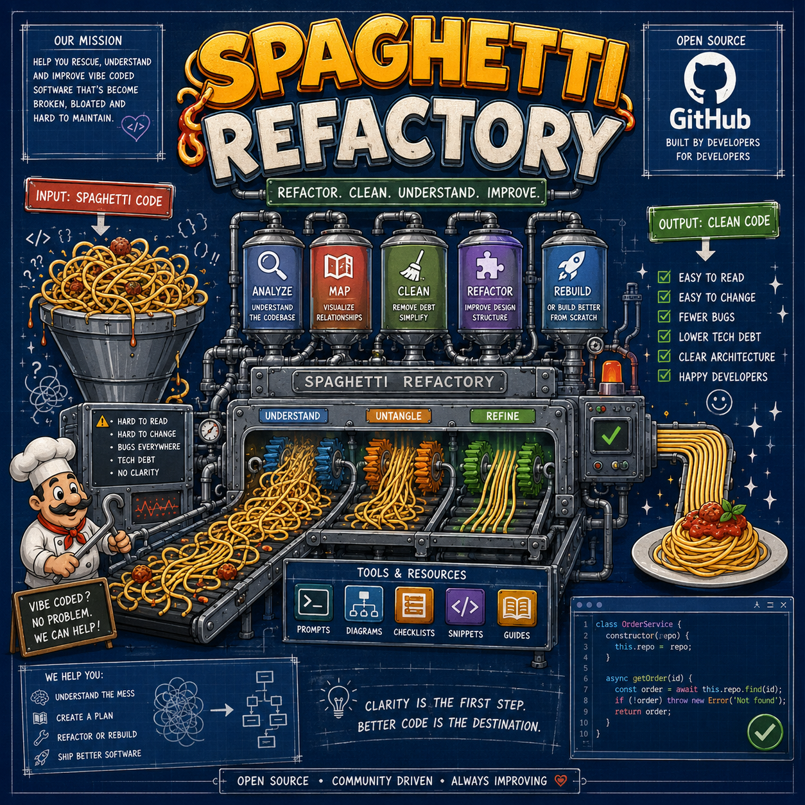

# Spaghetti Refactory



**Spaghetti Refactory** is an early public scaffold for a recovery framework for software that was built fast, grew messy, and became hard to understand.

This repo is public for visibility, feedback, and early community input.

It is for AI-assisted projects, vibe-coded apps, prototype-turned-production systems, and any codebase where the original builder can no longer confidently answer:

- What does this do?
- Where does this behavior live?
- What will break if I change this?
- Should this be refactored, rebuilt, or left alone?

The goal is to restore code clarity.

AI made it possible to create software faster than many people could learn architecture, testing, boundaries, and maintenance. Spaghetti Refactory exists to help teams slow down at the right moment, understand what they have, and turn working chaos into durable software.

## Core Rule

**Do not refactor the value-producing app first.**

Clone it. Preserve the system that is still delivering value. Use the clone to inspect, map, test, untangle, and decide whether the right path is:

- stabilize the current system
- refactor in place
- extract clean modules
- rebuild from scratch with a clearer design
- migrate gradually from old structure to new structure

Understanding comes before modification.

## Recovery Protocol

Spaghetti Refactory starts with a practical recovery sequence:

1. **Stabilize** - make sure the current app can still run, build, and deliver value.
2. **Map** - identify routes, modules, data flows, dependencies, services, and state boundaries.
3. **Understand** - explain how the system works before asking AI or humans to change it.
4. **Isolate** - find the highest-risk areas, tight coupling, duplicated logic, and unclear ownership.
5. **Decide** - choose refactor, rebuild, extraction, or containment based on evidence.
6. **Refactor** - simplify structure without changing behavior.
7. **Rebuild** - when needed, recreate the system from a cleaner architecture rather than endlessly patching the old one.
8. **Validate** - confirm behavior with tests, manual checks, and user-facing acceptance criteria.
9. **Migrate** - move from spaghetti to structure without losing the value the app already creates.

## Starter Workflows

This project will collect prompts, checklists, and lightweight tools for common recovery jobs:

- codebase comprehension
- architecture mapping
- dependency and coupling review
- dead code and unused package detection
- rewrite vs. refactor decision-making
- test coverage triage
- migration planning
- AI-assisted documentation
- module extraction
- production stabilization

The first principle for every workflow is the same:

> Explain before modify. Map before move. Stabilize before scale.

## Example Prompt: Codebase Forensics

Use this before asking an AI coding tool to fix anything:

```text
You are analyzing this codebase for comprehension only.

Do not modify files.
Do not propose implementation yet.

Build a clear model of the system:
- primary user flows
- application entry points
- major modules and responsibilities
- data storage and external services
- state management patterns
- build and deployment assumptions
- fragile or unclear areas
- duplicated logic
- high-risk dependencies

Return:
1. a concise architecture summary
2. a module map
3. the top risks to understand before changing code
4. questions that must be answered before refactoring
```

## Example Prompt: Refactor or Rebuild

Use this after the system has been mapped:

```text
Evaluate whether this project should be refactored in place, partially rebuilt, or rebuilt from scratch.

Base the recommendation on:
- current system behavior
- coupling and dependency structure
- test coverage
- unclear or duplicated logic
- user-facing value already working
- expected future changes
- migration risk

Return:
1. recommendation
2. reasoning
3. risks
4. minimum viable recovery plan
5. first three concrete steps
```

## Roadmap

Planned additions:

- recovery checklists
- agent prompts for Claude Code, Codex, Cursor, and other AI coding tools
- audit report templates
- architecture mapping examples
- before-and-after refactor case studies
- lightweight scripts for codebase inventory
- service offerings and audit packages

## Who Made This

Spaghetti Refactory is created by **Michael Gaio** and **Mythic Systems**.

- Michael Gaio: [michaelgaio.dev](https://michaelgaio.dev)
- Mythic Systems: [mythicsystems.com](https://mythicsystems.com)

## License

License is currently **TBD**. Until an official license is selected, all rights are reserved.

This project is public as an early concept scaffold, not yet as a formally licensed open-source release.

Community support, contribution guidance, and open-source project elements are coming very soon.

